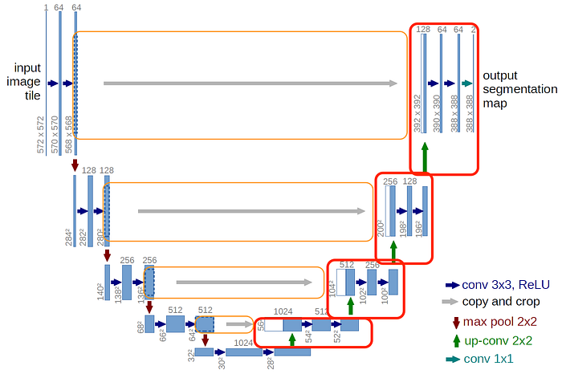
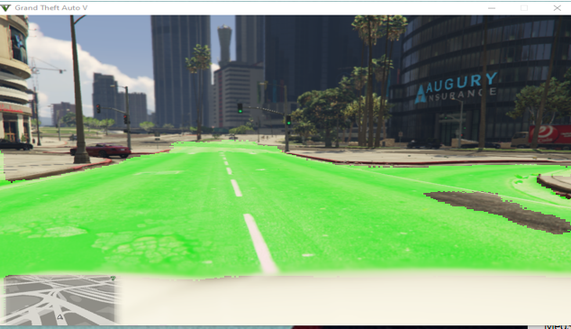
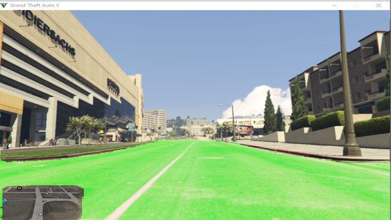

# Experimenting with U NET

  

#### I have to say that I was blown away to see how many features this model can retain with so few training samples ( 60 peaces )

  
  

##### as you can observe ,I excluded the map intentionally from the training masks data so we can use the gps feature in the self driving model
##### here is a mask sample

  

##### Looks like it works pretty well for lane marks

  

