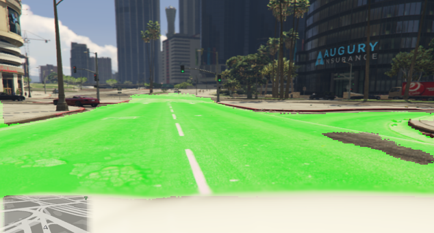
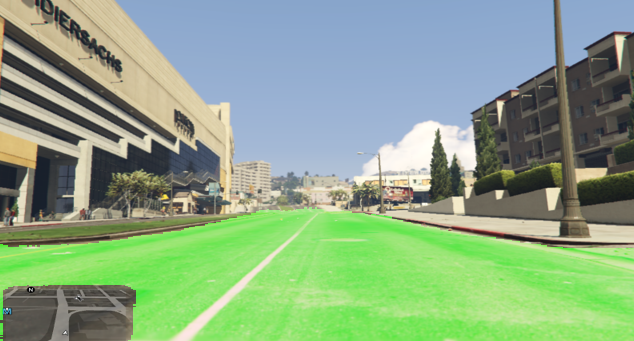
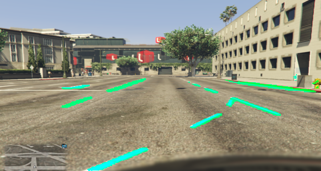

# Experimenting with U NET

#### I was blown away to see how good this model can perform with so few training samples (60 pieces)

  
  

##### As you can observe ,I excluded the map intentionally from the training masks data so we can use the gps feature in the self driving model
##### Here is a mask sample

  

##### Looks like it works pretty well for lane marks (300 mask samples were used in the training process)

  

